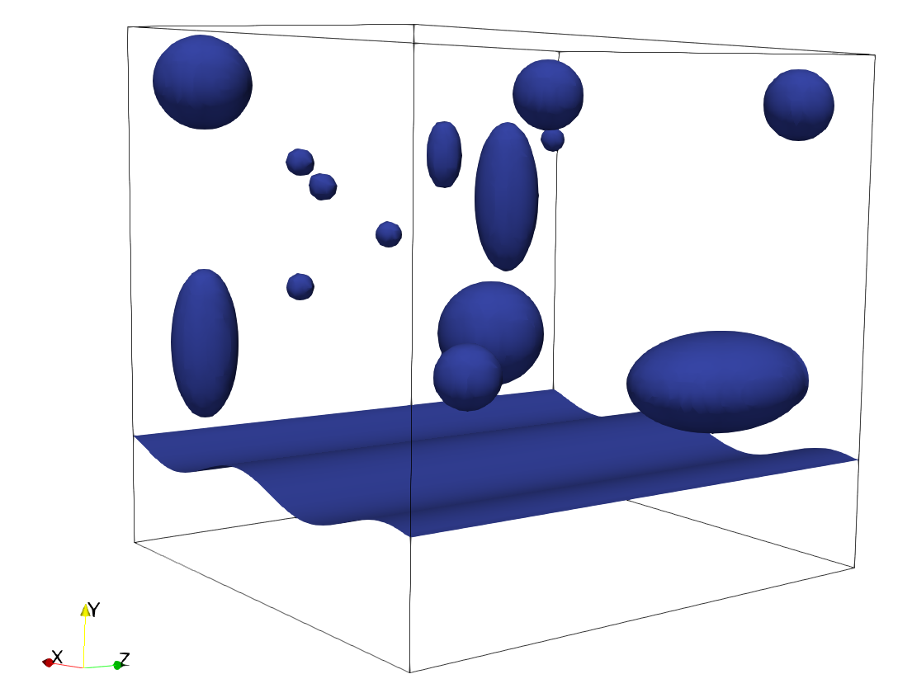

# setAlphaVofi

In order to achieve consistent initialization of phase fraction field values across different branches of OpenFOAM, we employed the same structure as `setAlphaField` to integrate the external library `Vofi`. This integration resulted in a new utility called `setAlphaVofi`, which is compatible with:
- OpenFOAM v22.06+ (tested in v22.06 v23.06 and v23.12)
- OpenFOAM 9+ (tested in v9, v10, v11 and v12)
- foam-extend-4.1+ (tested in fe-4.1 and fe-5.0). 

*NOTE*: for the OpenFOAM Foundation we have the sub directories [./OF-Found/v10-/](./OF-Found/v10-/) that was tested using v9 and v10 and [./OF-Found/v11+/](./OF-Found/v11+/) that was tested using v11 and v10.

## The `Vofi` library

Bnà et al. [1] developed an approach for initializing the phase fraction field based on the numerical integration of implicit functions for the initialization of the phase fraction field. This methodology was implemented in a computational library called `Vofi` [2] that was after optimized by Chierici et al. [3]. This C-based software package computes the volume fraction scalar field by numerically integrating the height function in three dimensions using double Gauss-Legendre integration with a variable number of nodes. The cited studies demonstrate that this approach yields highly accurate results in both two and three dimensions, with volume errors nearly zero.

## How to install `Vofi`

First of all, it is necessary to install the `Vofi 2.0` library. The step-by-step is described bellow. Steps 1 to 8 were just copied from the README of `Vofi 2.0`. Steps 9 and 10 are just adjustments in the `.bashrc` file to link `Vofi 2.0` and your OpenFOAM version.

1. Choose a local (e.g. `/home/username/foam`) or system (e.g. `/usr/local`) destination for `/installing_directory` which is write-able
2. Download the source code of `Vofi 2.0` in the chosen folder, opening a terminal in this directory and using
```
wget https://prod-dcd-datasets-cache-zipfiles.s3.eu-west-1.amazonaws.com/mbmzpbfxdz-1.zip
```
3. Extract the source code
```
unzip mbmzpbfxdz-1.zip; cp An\ optimized\ Vofi\ library\ to\ initialize\ the\ volume\ fraction\ field/vofi-2.0.tgz . ; tar -xzf vofi-2.0.tgz ; rm -r  An\ optimized\ Vofi\ library\ to\ initialize\ the\ volume\ fraction\ field/ mbmzpbfxdz-1.zip
```
4. Go to the extracted folder and run the script for configuration
```
./configure --prefix=/installing_directory
```
*NOTE:* by default, a shared library is built on platforms that support
     it; the user can specify modified forms of the configure flags 
     `--enable-shared` and `--enable-static`` to choose whether shared 
     and/or static libraries are built

5. Build the `Vofi 2.0` library and compile the tests using the Makefile
```
make all
```
6. Check the compilation running the tests
```
make check
```
*NOTE:* A test suite outcome for C, CPP and Fortran tests is printed
     both on terminal and in the file `test-suite.log``, containing 
     only the summary of the exit status of each executable.

7. Install the library 
```
make install
```
*NOTE:*if the installing_directory is `/usr/local`, then `libvofi.a`, 
     or `libvofi.so`, will be located in `/usr/local/lib64`, `vofi.h` in 
     `/usr/local/include` and the demo executables in `/usr/local/bin`.

8. Check the installation
```
make installcheck
```
*NOTE:* run all C, Fortran and CPP tests with the installed version of 
     the library. The output of each test is printed on terminal 
     together with the results obtained in our computer

9. Add a new line containing the export of Vofi path in the file `~/.bashrc`. Supposing that the library was installed in `$HOME/foam/` use the command
```
echo "export VOFI_DIR=$HOME/foam/Vofi-2.0">>$HOME/.bashrc
```
10.  Create an alias for the OpenFOAM togheter with `Vofi 2.0`. First open the file `gedit ~/.bashrc` using your favorite text editor. In the file, find the *alias* used for your OpenFOAM version, for example
```
alias fe50='source $HOME/foam/foam-extend-5.0/etc/bashrc'
```
Then, add the export for the `Vofi 2.0` to *alias* using the variable `LD_LIBRARY_PATH`:
```
export LD_LIBRARY_PATH=$VOFI_DIR/lib:$LD_LIBRARY_PATH
```
Whit this modification, the *alias* for OpenFOAM including the `Vofi 2.0` is writen as
```
alias fe50='source $HOME/foam/foam-extend-5.0/etc/bashrc; export LD_LIBRARY_PATH=$VOFI_DIR/lib:$LD_LIBRARY_PATH'
```
You can check if it was successfully done opening a **new terminal window** and using the command:
```
echo $LD_LIBRARY_PATH
```
If the output includes the path to `Vofi 2.0` it worked well and you can move to the next step: compile `setAlphaVofi`.

## How to compile `setAlphaVofi`

Inside the specific folders we have the source code of `setAlphaVofi` for [OpenFOAM Foundation](/OF-Found/src/), [OpenFOAM ESI](./OF-ESI/src/) and [foam-extend](./foam-extend/src/). You just need to compile what you need following the steps:

1. Go to the folder of the OpenFOAM version that you want to compile (Foundation, ESI or foam-extend).
2. Go to the src folder
```
cd src
```
3. Source the OpenFOAM version that you will use to compile and Vofi library using the alias crated in last topic (How to install `Vofi`)
4. Compile `setAlphaVofi` using `Allwmake`
```
./Allwmake
```
5. Test if `setAlphaVofi` compilation was successfully completed using the command bellow. If the output is an explanation about the utility it is working good.
```
setAlphaVofi -help
```

## How to use `setAlphaVofi`

Inside the specific folders we prepared tutorials to exemplify te use of `setAlphaVofi` in [OpenFOAM Foundation](/OF-Found/tutorials/), [OpenFOAM ESI](./OF-ESI/tutorials/) and [foam-extend](./foam-extend/tutorials/). The tutorial cases are:

- `oscillatingWave2D`: Initialization of a sin in a 2D domain [[OpenFOAM Foundation](/OF-Found/tutorials/oscillatingWave2D)] [[OpenFOAM ESI](./OF-ESI/tutorials/oscillatingWave2D)] [[foam-extend](./foam-extend/tutorials/oscillatingWave2D)]
- `sphereUnderPlate`: Initialization of a sphere in a 3D domain [[OpenFOAM Foundation](/OF-Found/tutorials/sphereUnderPlate)] [[OpenFOAM ESI](./OF-ESI/tutorials/sphereUnderPlate)] [[foam-extend](./foam-extend/tutorials/sphereUnderPlate)]
- `composeInitialization`: Composed initialization using sin, ellipsoid and sphere in a 3D domain [[OpenFOAM Foundation](/OF-Found/tutorials/composeInitialization)] [[OpenFOAM ESI](./OF-ESI/tutorials/composeInitialization)] [[foam-extend](./foam-extend/tutorials/composeInitialization)]


    <a href="url"></a>

Besides the tutorial cases it is possible to find a commented dictionary `setAlphaVofiDict` into the `src` folder of each specific version. You just need to create your own `setAlphaVofiDict` inside `system` and call for the utility using
```
setAlphaVofi -help
```
The result will be informed in the file `log.setAlphaVofi`, inclusively the information about the volume of the initialized body that can be used to check how accurate is this.


## References

[1] S. Bná, S. Manservisi, R. Scardovelli, P. Yecko, and S. Zaleski, "Numerical integration of implicit functions for the initialization of the vof function", *Computers & Fluids*, vol. 113, pp. 42–52, 2015.
[](https://doi.org/10.1016/j.compfluid.2014.04.010)

[2] S. Bná, S. Manservisi, R. Scardovelli, P. Yecko, and S. Zaleski, "Vofi - a library to initialize the volume fraction scalar field", *Computer Physics Communications*, vol. 200, pp. 291–299, 2016.
[](https://doi.org/10.1016/j.cpc.2015.10.026)

[3] A. Chierici, L. Chirco, V. Le Chenadec, R. Scardovelli, P. Yecko, and S. Zaleski, "An optimized vofi library to initialize the volume fraction field", *Computer Physics Communications*, vol. 281, p. 108506, 2022.
[](https://doi.org/10.1016/j.cpc.2022.108506)
